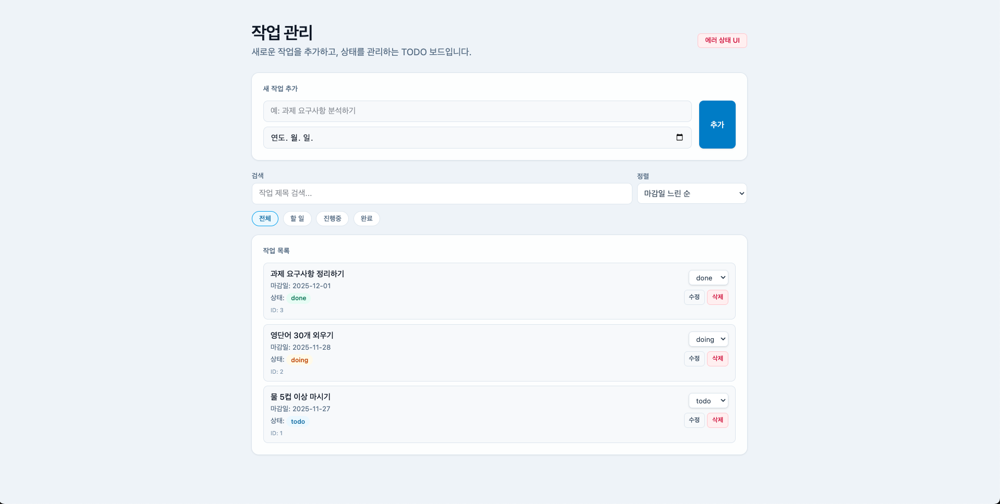
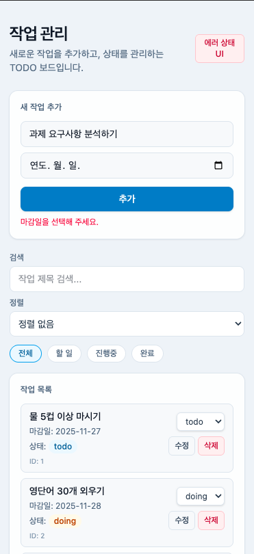
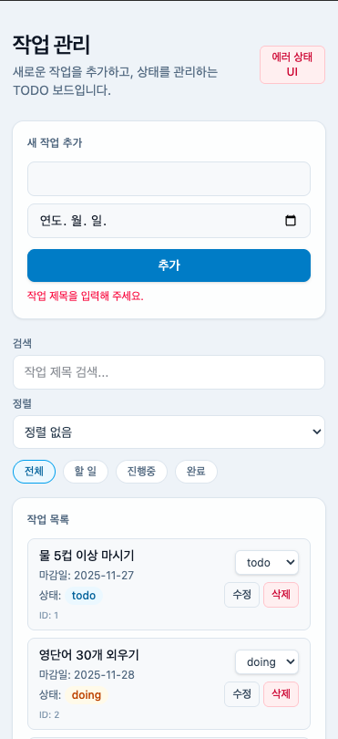
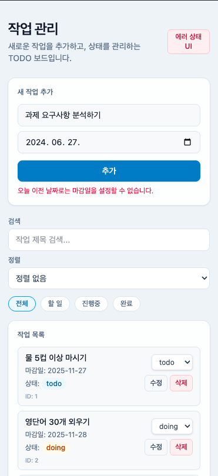
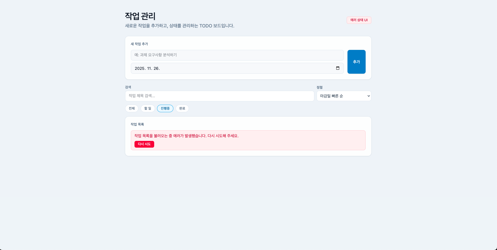

# Todo List

<p align="center">작업을 추가하고, 상태를 관리할 수 있는 TODO 보드입니다.</p>

<p align="center">
  
</p>

<br />

# 프로젝트 실행 방법

1. **패키지 설치**

   ```
   npm i
   ```

2. **개발 서버 실행**

   ```
   npm run dev
   ```

3. **브라우저에서 확인**  
   Vite가 출력해 주는 주소 ([🚀 로컬 실행화면 주소](http://localhost:5173))로 접속합니다.

<br />
<br />

# 사용한 기술 및 버전

## Framework & Bundler


## 스타일링


## 상태 관리


<br />
<br />

# 과제 진행 시 집중한 부분

## 역할 분리

- 작업의 CRUD는 `useTasks` 커스텀 훅으로 관리해,  
   컴포넌트에 의존하지 않고 어디서든 재사용할 수 있도록 분리했습니다.
- 필터/검색/정렬 상태는 `useTaskControlStore`(Zustand)로 전역 상태로 관리하여,  
  검색창 · 정렬 드롭다운 · 목록 컴포넌트가 동일한 UI 상태를 손쉽게 공유할 수 있도록 했습니다.  
  이로 인해 App 컴포넌트가 모든 뷰 상태를 들고 하위 컴포넌트로 계속 props를 전달하는 구조(props drilling)를 줄였습니다.

<br>

## 유효성 검사

|                   **마감일 미입력**                    |                  **작업 이름 미입력**                   |                  **유효하지 않은 날짜**                  |
| :----------------------------------------------------: | :-----------------------------------------------------: | :------------------------------------------------------: |
|  |  |  |

- 작업 추가/수정 시 **제목 필수 입력, 마감일 필수 입력**하도록 검증했습니다.  
  → 기본적인 TODO 앱이지만, 빈 작업이나 마감일이 없는 작업이 쌓이지 않도록 하기 위해 필수 값으로 설정했습니다.

- 오늘 날짜보다 과거 날짜는 선택할 수 없도록 했습니다.  
  → 이미 지나간 날짜를 마감일로 지정하면 실제로 관리 가능한 작업 목록과 혼동이 생기기 때문에,  
  검증 로직으로 사용자가 실수로 과거 날짜를 선택하지 못하도록 했습니다.

- 에러 메세지는 `FORM_ERROR_MESSAGES` 상수로 관리했습니다.  
  → 컴포넌트마다 문자열을 직접 쓰지 않고, 한 곳에서 문구를 관리할 수 있도록 중앙 집중화해서  
   추후 문구 수정이나 확장에도 유리하도록 했습니다.

<br>

## 비동기 처리 & 에러 상태 시뮬레이션



- `fetch("/mocks/tasks.json")` + `setTimeout`으로 1초 지연 후 초기 데이터 로딩했습니다.

- 로딩 중에는 "작업 목록을 불러오는 중입니다..." 문구를 표시합니다.

- 에러 발생 시 에러 메시지와 함께 "다시 시도" 버튼 노출했습니다.

- 헤더의 "에러 상태 UI" 버튼으로 에러 상태를 확인할 수 있도록 해 두었습니다.

<br>

## 검색 / 정렬 / 필터 조합

| 기능         | 설명                             | 상세 옵션                                                  |
| ------------ | -------------------------------- | ---------------------------------------------------------- |
| 🎯 상태 필터 | 작업 상태로 목록 분류            | 전체 / 할 일 / 진행중 / 완료                               |
| 🔎 검색      | 제목에 키워드 포함 여부로 필터링 | 예: "공부" 입력 시 "공부" 문구가 포함된 작업만 표시        |
| 📌 정렬      | 제목 또는 마감일 기준 정렬       | 제목 오름차순 / 내림차순 / 마감일 빠른 순 / 마감일 느린 순 |

- 이 세 조건을 모두 `getVisibleTasks` 유틸 함수에서 필터 → 검색 → 정렬 순서로 한 번에 적용해,  
  화면에 렌더링되기 직전에 최종 리스트를 계산하도록 구성했습니다.  
  이렇게 분리함으로써, 컴포넌트 안에서는 “보여줄 데이터”만 다루고,  
  “어떤 기준으로 필터링/정렬할지”는 유틸 함수 하나로 관리할 수 있도록 했습니다.

<br />
<br />

# 시간이 더 있었다면 개선하고 싶었던 부분

## 데이터 저장

- 현재는 메모리 상태와 `mocks/tasks.json`을 `fetch`로 불러오는 **임시 데이터 구조**에 의존하고 있어, 새로고침 시 작업 목록이 초기화됩니다.
- 상태 관리는 전역 상태 관리용으로 **Zustand**를 사용하고 있지만, 별도의 `persist` 설정은 두지 않아 **브라우저를 새로고침하면 상태가 모두 초기화되는 구조**입니다.

시간이 더 있었다면,

- 우선적으로 **Zustand의 `persist` 미들웨어**를 도입해, 브라우저 `localStorage`에 작업 목록을 저장하고 새로고침 시에도 그대로 복원되도록 개선했을 것 같습니다.
- 그 다음 단계로, 실제 API 서버와 연동하고 **Firestore Database + Firebase Auth**를 도입해:

  - 사용자별로 작업 데이터를 분리해 저장하고,
  - 로그인한 계정 기준으로 여러 기기에서 같은 TODO 리스트를 조회·수정할 수 있도록,
  - “클라이언트 로컬 상태”가 아닌 **실제 백엔드 데이터 저장소**를 사용하는 구조로 확장해 보고 싶습니다.

<br />
<br />

# 소요 시간

- 약 4시간

<br />
<br />
